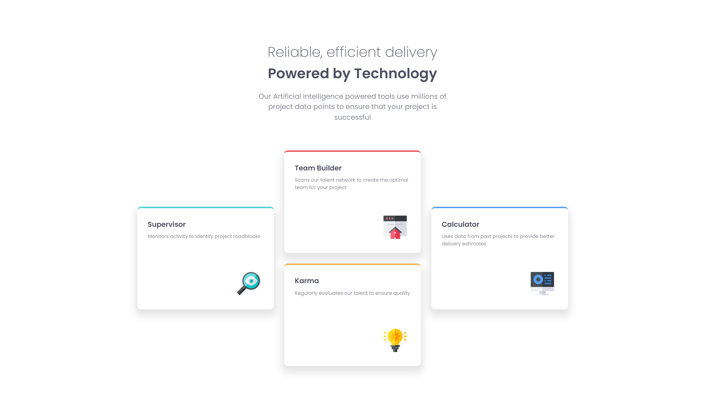

# Frontend Mentor - Four card feature section solution

This is a solution to the [Four card feature section challenge on Frontend Mentor](https://www.frontendmentor.io/challenges/four-card-feature-section-weK1eFYK). Frontend Mentor challenges help you improve your coding skills by building realistic projects. 

## Table of contents

- [Overview](#overview)
  - [The challenge](#the-challenge)
  - [Screenshot](#screenshot)
  - [Links](#links)
- [Author](#author)

### Screenshot

### Links

- Solution URL: [Github](https://github.com/SilverWings47/Four-card-section)
- Live Site URL: [Netlify](https://roaring-lokum-e5b115.netlify.app/)

## Author

- Frontend Mentor - [SilverWings47](https://www.frontendmentor.io/profile/SilverWings47)
- Twitter - [SilverWings](https://www.twitter.com/iSilverWings)
